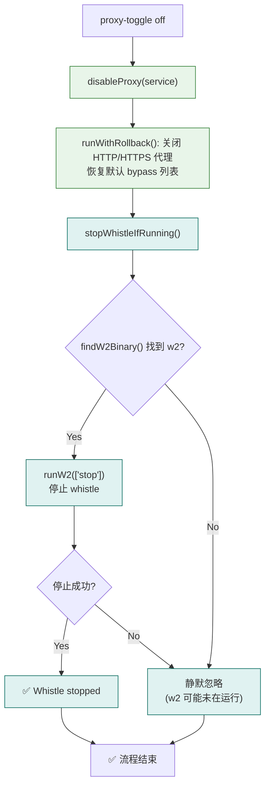

# proxy-toggle on / off 执行流程（含 w2 集成）

## 概述

`proxy-toggle on "Wi-Fi"` 的工作是为 macOS 的 "Wi-Fi" 网络服务开启 HTTP + HTTPS 系统代理（`127.0.0.1:8899`），**并在开启代理前自动启动 whistle**。内置快照保存、失败回滚和崩溃恢复机制。

代理关闭（`proxy-toggle off`）时会自动停止 whistle。

---

## proxy-toggle on 完整流程图

```mermaid
flowchart TD
    subgraph CLI["命令入口"]
        A["proxy-toggle on 'Wi-Fi'"] --> B["main()"]
    end

    subgraph Parse["参数解析 & 校验"]
        B --> C["validateCliArgs('on', ['Wi-Fi'])"]:::parse
        C --> C1{"cmd='list'?"}
        C1 -->|No| C2{"args.length > 1?"}
        C2 -->|No| C3["return { serviceArg: 'Wi-Fi' }"]:::parse
    end

    subgraph Recovery["崩溃恢复"]
        B --> D["recoverPendingStateIfNeeded()"]:::recovery
        D --> D1{"$TMPDIR/proxy-toggle-pending-<uid>.json 存在?"}
        D1 -->|Yes| D2["读取 pending state\n获取上次的 snapshot"]:::recovery
        D2 --> D3["⚠️ 打印警告"]:::recovery
        D3 --> D4["restoreProxy('service', snapshot)\n回滚 HTTP / HTTPS / bypass"]:::recovery
        D4 --> D5["clearPendingState()\n删除 pending 文件"]:::recovery
        D5 --> D6["✅ 打印恢复成功"]:::recovery
        D1 -->|No| E["继续执行"]
    end

    subgraph Discovery["服务发现 & 匹配"]
        E --> F["listServices()\n调用 networksetup -listallnetworkservices"]:::discover
        F --> F1{"服务列表为空?"}
        F1 -->|Yes| F2["❌ throw: No network services found"]
        F1 -->|No| G{"有 serviceArg='Wi-Fi'?"}
        G -->|Yes| G1["service = 'Wi-Fi'\n跳过自动发现"]:::discover
        G1 --> H{"'Wi-Fi' 在服务列表中?"}
        H -->|No| H1["❌ throw: Unknown service"]
        H -->|Yes| I["✅ service 确定 = 'Wi-Fi'"]:::discover
    end

    subgraph Dispatch["命令分发"]
        I --> J["switch(cmd)"]
        J -->|"case 'on'"| K["enableProxy('Wi-Fi')"]:::action
    end

    subgraph W2_Start["W2 自动启动（含自动安装）"]
        K --> W1["ensureWhistleRunning()"]:::w2
        W1 --> W2["hasLocalProxyListener()\n检查 :8899 是否在监听"]:::w2
        W2 --> W3{"已有进程监听 :8899?"}
        W3 -->|Yes| W4["已运行，跳过"]:::w2
        W3 -->|No| W5["runW2(['start', '-p', '8899'])\n尝试启动 whistle"]:::w2
        W5 --> W6{"启动成功?"}
        W6 -->|Yes| W9["✅ Whistle started"]:::w2
        W6 -->|No| W7{"w2 不存在?"}
        W7 -->|No（其他错误）| W10["⚠️ 打印失败原因\n提示手动启动"]:::warn
        W7 -->|Yes| W8["findPackageManager()\n查找 pnpm / npm"]:::w2
        W8 --> W11{"找到包管理器?"}
        W11 -->|No| W12["⚠️ 提示手动安装\nnpm i -g whistle"]:::warn
        W11 -->|Yes| W13["installWhistle(pm)\npm install -g whistle"]:::w2
        W13 --> W14{"安装成功?"}
        W14 -->|Yes| W15["重新 runW2(['start', '-p', '8899'])"]:::w2
        W15 --> W9
        W14 -->|No| W12
        W4 --> L
        W9 --> L
        W10 --> L
        W12 --> L
    end

    subgraph Rollback["runWithRollback 保护壳"]
        L["getProxySnapshot('Wi-Fi')\n采集 HTTP / HTTPS / bypass 快照"]:::snapshot
        L --> M["writePendingState('Enable proxy', 'Wi-Fi', snapshot)\n写入 $TMPDIR 崩溃恢复文件"]:::snapshot

        M --> N["执行 fn() — 实际代理设置"]:::action

        N --> N1["runNetworksetup(\n  '-setwebproxy', 'Wi-Fi',\n  '127.0.0.1', '8899'\n)"]:::networksetup
        N1 --> N2["runNetworksetup(\n  '-setwebproxystate', 'Wi-Fi', 'on'\n)"]:::networksetup
        N2 --> N3["runNetworksetup(\n  '-setsecurewebproxy', 'Wi-Fi',\n  '127.0.0.1', '8899'\n)"]:::networksetup
        N3 --> N4["runNetworksetup(\n  '-setsecurewebproxystate', 'Wi-Fi', 'on'\n)"]:::networksetup

        N4 --> O{"执行成功?"}
        O -->|Yes| P["clearPendingState()\n删除 pending 文件"]:::cleanup
        O -->|No| Q["restoreProxy('Wi-Fi', snapshot)\n恢复 HTTP / HTTPS / bypass"]:::rollback
        Q --> R["clearPendingState()\n删除 pending 文件"]:::rollback
        R --> S["❌ throw:\n'Enable proxy failed and\nprevious state was restored'"]:::error
    end

    subgraph Result["完成"]
        P --> T["✅ console.log\n'Proxy enabled on Wi-Fi:\n127.0.0.1:8899 (HTTP + HTTPS)'"]:::success
        T --> V["✅ 流程结束"]
    end

    %% Styles
    classDef parse fill:#e1f5fe,stroke:#01579b
    classDef recovery fill:#fff3e0,stroke:#e65100
    classDef discover fill:#f3e5f5,stroke:#7b1fa2
    classDef action fill:#e8f5e9,stroke:#2e7d32
    classDef snapshot fill:#fff8e1,stroke:#f9a825
    classDef networksetup fill:#eceff1,stroke:#546e7a
    classDef cleanup fill:#e8f5e9,stroke:#2e7d32
    classDef rollback fill:#ffebee,stroke:#c62828
    classDef error fill:#ffcdd2,stroke:#b71c1c
    classDef success fill:#c8e6c9,stroke:#1b5e20
    classDef warn fill:#fff9c4,stroke:#f57f17
    classDef w2 fill:#e0f2f1,stroke:#00695c
```



---

## proxy-toggle off 流程图（w2 自动停止）



---

## 关键函数职责说明

### 1. `main()` — 总调度
- 解析 CLI 参数，识别 command 和 service
- 先执行崩溃恢复 → 再执行业务逻辑
- 通过 `switch` 将 "on" 分发到 `enableProxy()`，"off" 分发到 `disableProxy()`

### 2. `recoverPendingStateIfNeeded()` — 崩溃恢复
- 检查 `$TMPDIR/proxy-toggle-pending-<uid>.json` 是否存在
- 若存在说明上次操作被中断（如进程 crash），立即用保存的 snapshot 回滚代理状态
- 恢复后删除 pending 文件，打印恢复日志，然后继续执行当前命令

### 3. `listServices()` — 服务发现
- 调用 `networksetup -listallnetworkservices` 获取 macOS 所有网络服务名称
- 过滤掉标题行（如 `An asterisk (*) denotes...`）

### 4. `enableProxy("Wi-Fi")` — 开启代理（含 w2 启动）
- **先调用 `ensureWhistleRunning()`** 尝试自动启动 whistle
- 然后再通过 `runWithRollback()` 设置系统代理

### 5. `disableProxy("Wi-Fi")` — 关闭代理（含 w2 停止）
- 通过 `runWithRollback()` 关闭系统代理 + 恢复 bypass
- **后调用 `stopWhistleIfRunning()`** 停止 whistle

### 6. `ensureWhistleRunning()` — 自动启动 whistle（含自动安装）
- `hasLocalProxyListener()` 检查 `127.0.0.1:8899` 是否已有监听进程 → 已有则跳过
- 尝试 `w2 start -p 8899` → 成功则打印 "Whistle started"
- w2 不存在 → `findPackageManager()` 查找 pnpm/npm → `installWhistle(pm)` 自动安装
- 安装成功后重新尝试 `w2 start -p 8899`
- 安装失败或无包管理器 → 打印原因 + 手动安装提示 → **不阻塞代理设置**

### 7. `stopWhistleIfRunning()` — 自动停止 whistle
- `disableProxy()` 末尾调用
- 找到 w2 → 执行 `w2 stop` → 打印 "Whistle stopped"
- 未找到 w2 或停止失败 → 静默忽略

### 8. `runWithRollback(service, actionName, fn)` — 事务保护
核心安全机制，确保操作可回滚：

| 步骤 | 操作 |
|---|---|
| ① | `getProxySnapshot(service)` — 采集当前 HTTP/HTTPS 状态 & bypass 域名列表 |
| ② | `writePendingState()` — 将 snapshot + action 元信息写入 `$TMPDIR` 文件（权限 `0600`） |
| ③ | 执行 `fn()` — 实际调用 networksetup 修改系统代理 |
| ④ (成功) | `clearPendingState()` — 删除 pending 文件 |
| ④ (失败) | `restoreProxy(service, snapshot)` → `clearPendingState()` → 抛出回滚错误 |

### 9. `findW2Binary()` — w2 二进制查找
按优先级查找：
1. `npm config get prefix`/bin/w2
2. `/usr/local/bin/w2`
3. `/opt/homebrew/bin/w2`
4. `which w2`（最后兜底）

### 10. `findPackageManager()` — 包管理器检测
按优先级：pnpm → npm。返回可执行路径，均未找到返回 null。

### 11. `installWhistle(pm)` — 自动安装 whistle
执行 `{pm} install -g whistle`（120s 超时），返回 `{ ok, reason }`。

---

## networksetup 调用序列

```bash
# 0. (前置) 自动启动 whistle（已有监听则跳过；w2 不存在则自动安装）
#    0a. 检测包管理器: pnpm / npm
#    0b. {pm} install -g whistle   （仅 w2 不存在时）
#    0c. w2 start -p 8899

# 1. 设置 HTTP 代理地址
/usr/sbin/networksetup -setwebproxy "Wi-Fi" 127.0.0.1 8899

# 2. 启用 HTTP 代理
/usr/sbin/networksetup -setwebproxystate "Wi-Fi" on

# 3. 设置 HTTPS 代理地址
/usr/sbin/networksetup -setsecurewebproxy "Wi-Fi" 127.0.0.1 8899

# 4. 启用 HTTPS 代理
/usr/sbin/networksetup -setsecurewebproxystate "Wi-Fi" on
```

### proxy-toggle off

```bash
# 1. 关闭 HTTP 代理
/usr/sbin/networksetup -setwebproxystate "Wi-Fi" off

# 2. 关闭 HTTPS 代理
/usr/sbin/networksetup -setsecurewebproxystate "Wi-Fi" off

# 3. 恢复默认 bypass 列表
/usr/sbin/networksetup -setproxybypassdomains "Wi-Fi" 127.0.0.1 192.168.0.0/16 ...

# 4. (后置) 自动停止 whistle
w2 stop
```

---

## 安全设计要点

| 机制 | 作用 |
|---|---|
| 快照保存 | 每次操作前保存完整代理状态，失败时精确回滚 |
| Pending 文件 | 崩溃恢复：进程中断后下次启动自动恢复 |
| 文件权限 0600 | pending 文件含代理配置（可能含认证信息），仅当前用户可读写 |
| PATH 固定 | 系统命令 PATH 限定为 `/usr/sbin:/usr/bin:/bin:/sbin`，防止恶意 PATH 注入 |
| 二进制校验 | `networksetup` / `route` 启动时验证可执行性 |
| w2 优雅降级 | w2 未安装/启动失败/安装失败均不阻塞代理设置，输出警告后继续 |
| w2 自动安装 | w2 不存在时依次尝试 pnpm → npm 全局安装 whistle（120s 超时） |
